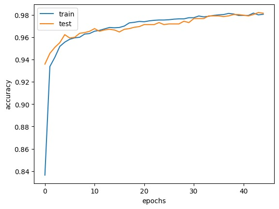
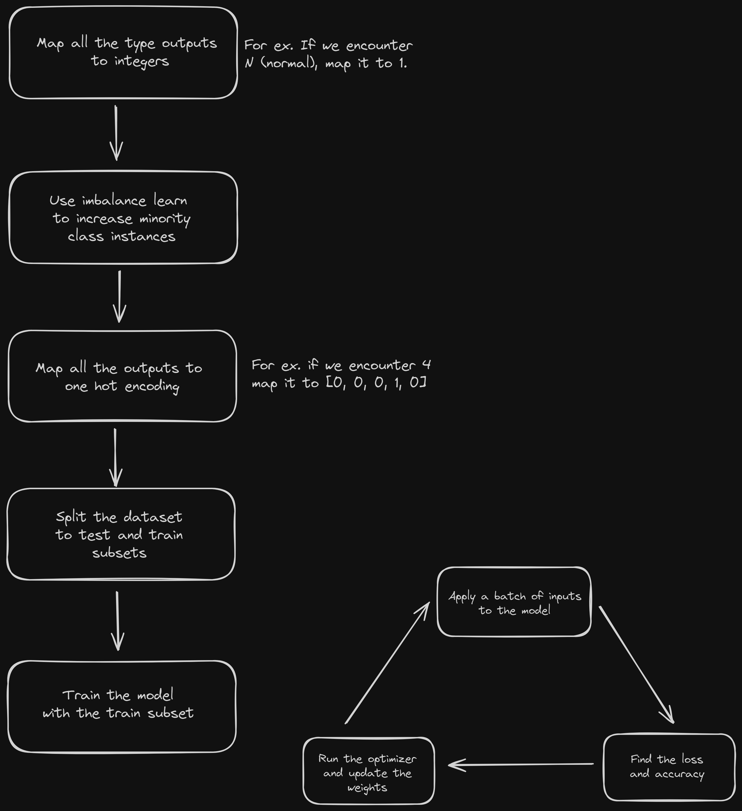
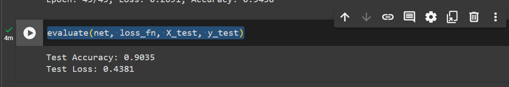

## ANN

- Download `ann.ipynb` and `ann_train.csv` to replicate my work
- You need these libraries:
  1. [matplotlib](https://matplotlib.org/stable/users/installing/index.html)
  2. [pytorch](https://pytorch.org/get-started/locally/)
  3. [numpy](https://numpy.org/install/)
  4. [pandas](https://pandas.pydata.org/docs/getting_started/index.html)
- In addition to them you need inbuilt modules like copy and random

### Results

- got around 98% accuracy for `Arrhythmia_classifier`

  

- ANN and SNN networks can be calculated now. Download [spikes.ipynb](spikes.ipynb) file and run it with the biases and weights you got after running the `Arrhythmia_classifier` model from [ann.ipynb](ann.ipynb) .

## SNN

- Download the `snn.ipynb` and `4vectors.csv` file to replicate my work.
- You need these libraries:

  1. [snntorch](https://snntorch.readthedocs.io/en/latest/installation.html)
  2. [pytorch](https://pytorch.org/get-started/locally/)
  3. [sklearn](https://scikit-learn.org/stable/install.html)
  4. [imbalencelearn](https://imbalanced-learn.org/stable/install.html#install)
  5. [matplotlib](https://matplotlib.org/stable/users/installing/index.html)
  6. [pandas](https://pandas.pydata.org/docs/getting_started/index.html)
  7. [numpy](https://numpy.org/install/)

- Additionally, you can run the same model on [google colab](https://colab.research.google.com/drive/1N-AktU81E7MLk7sNnJTLz6HFH02jZZE7?authuser=2#scrollTo=muthEIojCmk_).
- If you have an Nvidia GPU, install CUDA to take advantage of your GPU which highly reduces the time taken to train the model.

### Network Structure

- num of inputs - 4
- num of hidden layers - 8
- num of output - 5

Input feature vectors include `rr_interval`, `qrs_interval`, `st_interval`, `qt_interval`.

### A quick overview of preprocessing.

If you want to update the flowchart, open [flowchart.excalidraw](./flowchart.excalidraw) on [excalidraw](https://excalidraw.com)

### How to play with the parameters

- parameters you can change include `beta` for the LIF neurons, the `sampling strategy`, `learning_rate` specified in the [ADAM](https://pytorch.org/docs/stable/generated/torch.optim.Adam.html#torch.optim.Adam) optimizer.
- `beta` is the decay rate of membrane potential, clipped between 0 and 1 during the forward-pass.
- To know more about LIF neurons, visit [this](https://snntorch.readthedocs.io/en/latest/tutorials/tutorial_2.html) website.
- sampling strategy is used to over sample classes whose count is very less. Whatever the number you assign to a particular key, that will be the number of elements in the final dataset before splitting for training and testing.
- The over sampling method used is [SMOTE](https://imbalanced-learn.org/stable/references/generated/imblearn.over_sampling.SMOTE.html#smote).

### Results

